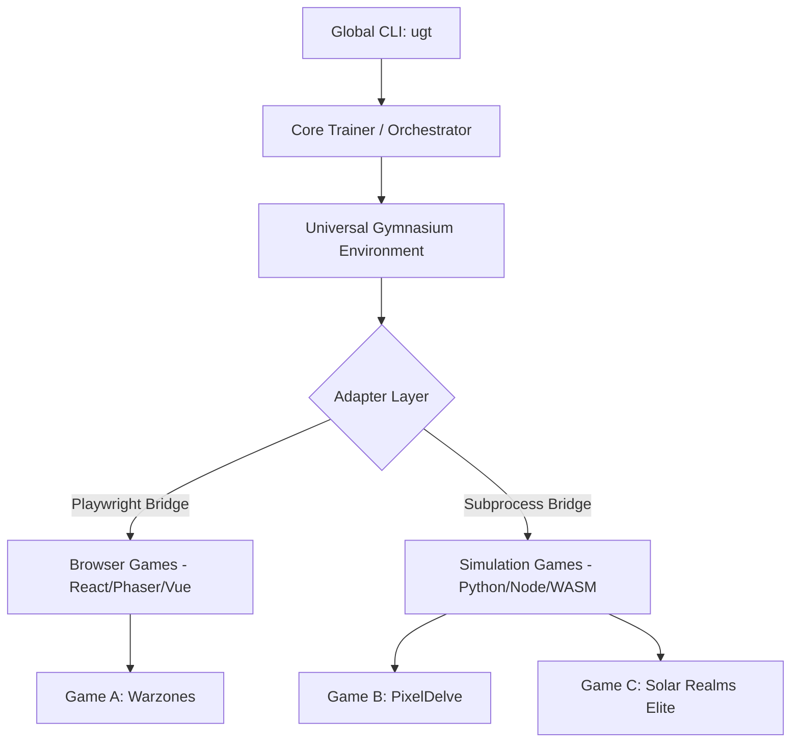

# Assessment Report: Universal Game Tester (UGT)

An assessment on transforming our project-specific game testing framework (from the *Warzones* prototype) into a **Universal Game Tester (UGT)**. This system will be globally installable, configurable at the project level via a standardized config file, and capable of testing both visual browser-based and fast headless simulation games across our entire portfolio.

## Current Status

| Stage | Status | Notes |
|---|---|---|
| Stage 1: Config Parser & Core Bridge | ✅ Complete | Config validation hardened with shape/mappings guards |
| Stage 2: Dynamic Environment & Trainer | ✅ Complete | SubprocVecEnv parallel training, multi-algorithm (PPO/DQN/A2C), checkpointing |
| Stage 3: Porting Warzones | ✅ Complete | IPC bridge wrapping the full sim, smoke-tested and verified |
| Stage 4: Porting a Second Game | ⏳ Pending | Browser game example created; real game port (ENS/SRE) pending |
| Dashboard | ✅ Complete | `ugt dashboard` launches TensorBoard |
| Playwright Adapter | ✅ Overhauled | Adaptive waiting, structured responses, soft-reset support |

---

## 1. Architectural Strategy: The Standardization Problem

To make a Reinforcement Learning (RL) testing framework universal, we must decouple the core training algorithm (PyTorch / Stable Baselines3) from the domain knowledge of any individual game. 

The universal system must be designed as a **Core Orchestrator** that communicates with games through a **Standardized Adapter Layer**:



### The Standardized Bridge
A game must implement a standard interface for the UGT to control it. We define this interface using two endpoints:
1. **`window.__GET_STATE__()` (or JSON subprocess stdout):** Returns the current game state as a JSON object.
2. **`window.__SEND_ACTION__(actionId, params)` (or JSON subprocess stdin):** Takes a standardized action command and advances the game state.

---

## 2. Project-Level Declarative Configuration (`ugt.config.yaml`)

Each game project will contain a `ugt.config.yaml` file in its root directory. This file maps the game's specific structures (like AP, Gold, or coordinates) into a standardized format that the PyTorch neural network can understand, and defines reward parameters declaratively.

### Example Configuration: `ugt.config.yaml`
```yaml
project:
  name: "Warzones"
  version: "1.0.0"

engine:
  type: "browser" # Options: browser | simulation
  entry: "http://localhost:3000" # Browser url OR path to headless sim script
  reset_command: "page.reload()" # Reset hook for browser OR restart cmd for sim

# Defining the numerical mapping for PyTorch inputs
observation_space:
  type: "box" # Standard Gymnasium Box (continuous numeric vector)
  shape: 15
  mappings:
    - path: "player.credits"
      min: 0
      max: 100000
    - path: "player.ap"
      min: 0
      max: 100
    - path: "player.sectors_owned"
      min: 0
      max: 30
    - path: "enemy.sectors_owned"
      min: 0
      max: 30
    # Arrays can be flattened or aggregated
    - path: "player.fleet"
      aggregator: "count"
      min: 0
      max: 50

# Translating flat integer outputs from PyTorch into game actions
action_space:
  type: "discrete"
  size: 5
  actions:
    0: { name: "wait" }
    1: { name: "move_closest_sector" }
    2: { name: "attack_weakest_enemy" }
    3: { name: "build_scout" }
    4: { name: "end_turn" }

# Declarative reward profiles (Evaluated dynamically)
reward_profiles:
  aggro:
    formula: "(state.combat_kills * 100) + (state.sectors_captured * 50) - (state.turns_elapsed * 2)"
    win_bonus: 500
    loss_penalty: 100
  eco:
    formula: "(state.credits * 0.01) - (state.hull_damage * 50)"
    win_bonus: 500
    loss_penalty: 200

training:
  algorithm: "PPO" # PPO, DQN, SAC
  total_timesteps: 500000
  parallel_envs: 4
  checkpoint_freq: 50000
```

---

## 3. Global Installation & CLI Layout

We can bundle the system as a Node/Python package installable globally via NPM or Pip:
```bash
npm install -g @ugt/core
# or
pip install --user ugt-tester
```

### Global CLI Syntax
```bash
# Initialize a new game configuration template
ugt init

# Verify game adapter interface (runs a random agent for sanity check)
ugt smoke-test --config ugt.config.yaml

# Train an agent using a specific reward profile from the config
ugt train --profile aggro

# Run a 1,000-game statistical sweep to generate balance analytics
ugt evaluate --model ./models/best_model.zip --episodes 1000

# View training metrics in a local web interface
ugt dashboard --logdir ./logs
```

---

## 4. Proposed Repository Structure (`_ML_Tester`)

To build this inside `_ML_Tester`, we should adopt a clean, robust, and extensible modular structure:

```
_ML_Tester/
├── bin/
│   └── ugt                      # Executable CLI shell script wrapper
├── ugt/
│   ├── __init__.py
│   ├── cli.py                   # Command-line argument parsing
│   ├── core/
│   │   ├── __init__.py
│   │   ├── env.py               # Custom Gymnasium environment mapping config schemas
│   │   ├── trainer.py           # Wrapper for Stable Baselines3 PPO/DQN
│   │   └── evaluator.py         # 1000-game evaluation, metric compiler, summary generator
│   │
│   ├── adapters/
│   │   ├── __init__.py
│   │   ├── base.py              # Base adapter interface class
│   │   ├── playwright.py        # Playwright web bridge
│   │   └── subprocess.py        # Subprocess pipeline for command-line sims
│   │
│   └── utils/
│       ├── __init__.py
│       ├── config_parser.py     # Parses, validates, and compiles ugt.config.yaml
│       └── formula_evaluator.py # Safely parses reward formulas at runtime
│
├── examples/                    # Sample configs and game integrations
│   └── warzones-demo/
│       └── ugt.config.yaml
├── setup.py                     # Packaging script for local pip install -e .
└── README.md                    # System architecture documentation
```

---

## 5. Development Roadmap: Bringing UGT to Life

### Stage 1: The Config Parser & Core Bridge ✅
* Built `config_parser.py` using `pyyaml` with comprehensive validation — including shape/mappings cross-checks and action size guards.
* Implemented `base.py` and the two adapters (`playwright.py` and `subprocess.py`).
* Verified communication using a mock simulation game and a mock HTML5 browser game.

### Stage 2: Dynamic Environment & Trainer ✅
* Implemented `env.py` which dynamically constructs observation and action spaces at runtime from parsed YAML.
* Integrated the safe AST formula evaluator with logging for evaluation failures.
* Connected **Stable Baselines3** with `SubprocVecEnv` for parallel training, multi-algorithm support (PPO/DQN/A2C), and periodic checkpointing.

### Stage 3: Porting Warzones ✅
* Ported **Warzones** by creating a `sim_bridge.py` IPC wrapper and `ugt.config.yaml` with 10-element observation space.
* Smoke-tested all 5 actions (end_turn, scan, deploy_fighter, warp, trade) against the full game engine.
* Reward formulas are simplified vs. the bespoke model (no delta tracking or conditionals).

### Stage 4: Porting a Second Game ⏳
* Port a second game (e.g. **ENS** via browser adapter or **Solar Realms Elite**) to demonstrate cross-game universality.
* A browser game example (`examples/browser-game/`) has been created as a Playwright adapter reference implementation.

---

> [!NOTE]
> The framework's **Safe Formula Evaluator** uses `ast.parse` with a strict operator whitelist to evaluate reward formulas from YAML without `eval()` risk. It supports nested attribute access (`state.player.credits`), bracket subscripts, and basic arithmetic (+, -, *, /, **).

> [!TIP]
> The Playwright adapter now implements adaptive waiting and soft-reset support. Games that expose `window.__RESET_GAME__()` reduce browser restart latency from **15 seconds** to **less than 20 milliseconds**, making E2E browser training viable. The adapter uses `wait_for_function()` instead of `time.sleep()` to avoid wasting training time.
